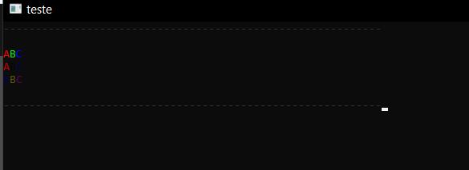

# samp-terminal
plugin simples manuseio de terminal

### Ex:
```pawn
TerminalTitle("teste");
TerminalCommand("cls");
print_t("\x1b[38;5;236m-----------------------------------------------------------");

new string[128];
format(string, 128, "\n\n%sA%sB%sC\n", ColorASII(TERMINAL_FORE, 255), ColorASII(TERMINAL_FORE, 0, 255), ColorASII(TERMINAL_FORE, 0, 0, 255));
print_t(string);
format(string, 128, "%sA%sB%sC\n", ColorASII(TERMINAL_FORE, 200), ColorASII(TERMINAL_FORE, 0, 10), ColorASII(TERMINAL_FORE, 0, 0, 90));
print_t(string);
format(string, 128, "%sA%sB%sC\n\n", ColorASII(TERMINAL_FORE, -1, -1, -1), ColorASII(TERMINAL_FORE, 90, 90), ColorASII(TERMINAL_FORE, 90, 0, 90));
print_t(string);

print_t("\x1b[38;5;236m-----------------------------------------------------------");
```



[SDK](https://github.com/Zeex/samp-plugin-sdk)
